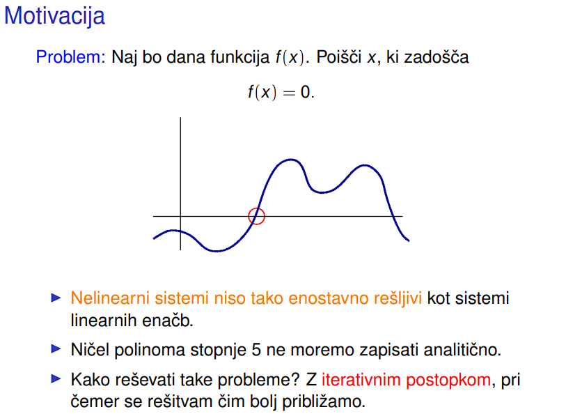
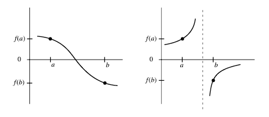
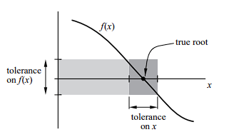
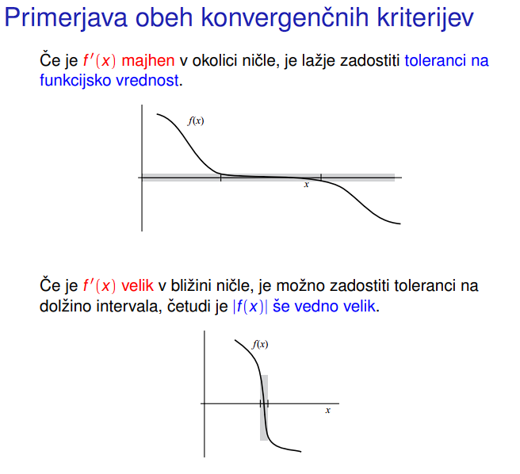
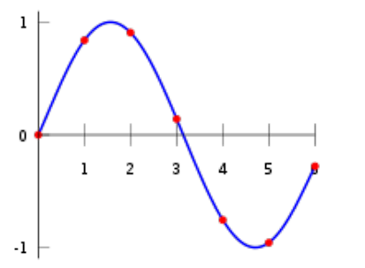

# NM Learning

## Numerična matematika

## Kako?

- Realni problem ---POENOSTAVITEV---> idealiziran problem, (manj natančen/realen ampak zadovoljiv za naše potrebe)
- Posplošitev idealiziranjega problema v matematični model.
- Algoritem za reševanje matematičnega modela.
- Implementacija algoritma v programskem jeziku.

### Tipična vprašanja NM

- Ali je problem občutljiv?
  - Ali se točna rešitev problema bistveno spremeni če le malo spremenimo vhodne podatke?
  - To je odvisno od problema in ne od izbrane numerične metode.
  - **NM ne mora rešiti občutljivih problemov.**
- Ali je metoda dobra?
  - Ali se ob majhni spremembi vhodnih podatkov tudi napaka rezultata le malo spremeni?
- Ali je algoritem robusten?
  - Ali deluje na širokem spektru problemov?
- Ali je implementacija hitra?
  - Ali je časovno in prostorsko zahtevna?

## FP in NM

FP števila predstavimo kot: $x = \plusmn0.d_0d_1d_2d_3...d_n * \beta^e$
Kjer je: $d_0..d_n...\space mantisa,\space e...\space eksponent, \beta...\space baza\space(2\space v \space računalništvu)$

Primer (Baza 10):
$0.0123 = +(0.123)_{10} * 10^{-1}$

#### IEEE 754: Floating-point arithmetic

##### single precision: 32 bitov

- 1 bit predznak, 8 bitov exponent, 23 bitov manisa

##### double precision: 64 bitov

- 1 bit predznak, 11 bitov exponent, 52 bitov mantisa

### Zaokrožitvene napake

Večine realnih števil ne moramo natančno predstaviti v strojni aritmetiki, zato pride do zaokrožitev in posledično do **zaokrožitvenih napak**.

IEEE standard zaokroži $x$ do najbližjega predstavljivega števila fl(x).

$X_{-} \le X \le X_{+}$

$fl(x) = \left\{
	\begin{array}{ll}
		X_{-} & if \space X\space closer\space to\space X_{-}
    \\
    X_{+} & if \space X\space closer\space to\space X_{+}
	\end{array}\right.$

#### Možnosti zaokrožitev za X
$X = +(0.1b_2b_3...b_mb_{m+1})_2 * 2^e$
$X_{-} = +(0.1b_2b_3...b_m)_2 * 2^e$
$X_{+} = +((0.1b_2b_3...b_m)_2 + 2^{-m}) * 2^e$
#### Absolutna in relativna zaokrožitvena napaka:
- Absolutna napaka
$X-X_{-} \le \frac{X_{+} - X_{-}}{2} = 2^{e-m-1}$

- Relativna napaka:
$\frac{X - X_{-} }{X} \le \frac{2^{e-m-2}}{\frac{2^e}{2}} \le 2^{-m}...\space \bold{osnovna\space zaokrožitvena\space napaka \dots u}$

Velja: $|\delta| < u, \dots fl(X) = X * (1+\delta)$

aka. Nepredstavljivo število X se preslika v predstavljivo število X + napaka $X*\delta$.


#### Računanje s predstavljivimi števili

Za **predstavljivi** števili x, y in katerokoli od osnovnih operacij $\bigodot \isin \{+,-,\cdot,:\}$,
rezultat $x\bigodot y$ **ni nujno predstavljivo število**.  

**Seštevanje numerično ni asociativna operacija:**
$(a+b) + c \neq a + (b+c)$

Za čimbolj natančno računanje seštevamo od manjših k večjim številom.

### Napake pri numeričnem računanju

- Neodstranljiva napaka: $Dn$ ... nenatančni začetni podatki
- Napaka metode: $Dm$ ... napake zaradi matematičnega modela (npr. neskončni proces aproksimiramo s knočnim)
- Zaokrožitvena napaka: $Dz$ ... zaradi zaokroževanja nepredstavljivih števil

Celotna napaka: $D = Dn + Dm + Dz$


## Numerična stabilnost
Stabilnost metode preverimo z analizo zaokrožitvenih napak.  

Poznamo:
- Absolutno napako: $X - X_{-}$
- Relativno napako: $\frac{X - X_{-}}{X}$
- Direktno napako: Numerična napaka rezultata
- Obrano napako: Koliko moramo spremeniti zečetne podatke, da dobimo **točen** rezultat enak temu, ki smo ga dobili (naš netočen rezultat).

### Primer nestabilne operacije

#### Seštevanje in odštevanje sta lahko katastrofalni
- odštevanje dveh približno enakih števil
- seštevanje dveh približno nasprotnih števil

Seštevanje in odštevanje načeloma nista relativno direktno stabilni operaciji, množenje in deljenje pa sta relativno direktno stabilni.  

Relativna napaka pri seštevanju (in odštevanju) se izkaže za:
$p = x + y$
$\overline p \dots približek$

$\overline p = fl(fl(x) * fl(y)) = fl(x(1+\delta1) * y(1+\delta2))$
$= (1+\delta3) * x(1+\delta1) * y(1+\delta2)$
$= xy(1+\delta1 + \delta2 + \delta3 + produkti\space več\space \delta)$
$\frac{|\overline{p} - p|}{|p|} = \frac{|x(\delta_1+\delta_3+\delta_1\delta_3) + y(\delta_2+\delta_3 + \delta_2\delta_3)|}{|x+y|}$

Če je x+y blizu 0, potem je vrednost $\frac{|\overline{p} - p|}{|p|}$ $\rArr$(relativna napaka) velika.

Pri množenju in deljenju se izkaže, da relativna napaka ni odvisna od produkta xy:
$p = x * y$
$\overline p \dots približek$
$\frac{|\overline{p} - p|}{|p|} = \frac{|xy||\delta1 + \delta2 + \delta3 + \mathcal{O}(u^2)|}{|xy|} = 
|\delta1 + \delta2 + \delta3 + \mathcal{O}(u^2)|$

Kot vidimo na koncu |xy| ni nikjer več, kar pomeni, da je relativna napaka neodvisna od produkta xy $\rArr$ relativno direktno stabilna operacija. 


Večina numeričnih metod ni relativno direktno stabilnih: 
**povsod kjer se nahaja + ali -** in kot rezultat dobimo npr. vrednost 0 ali nekje po poti kot vmesno vrednost skoraj [singularno matriko](https://en.wikipedia.org/wiki/Singular_matrix), (matrika, ki nima inverza aka det(A) = 0).


## Linearni sistem enačb
Matrična oblika: $Ax = b$

### Direktne metode:
- Gaussova eliminacija
- LU razcep
- Pivotiranje
- Pivotna rast

### Iterativne metode:
- Jacobi
- Gauss-Seidel
- SOR
- SSOR
- konjugirani gradienti

### Reševanje kvadratnih linearnih sistemov

Linearni sistem n enačb z n nezankami $x1,x2,\dots,x_n$, je oblike:
$a_{11}x_1 + a_{12}x_2 + \dots + a_{1n}x_n = b_1$
$a_{21}x_1 + a_{22}x_2 + \dots + a_{2n}x_n = b_2$
$\dots$
$a_{n1}x_1 + a_{n2}x_2 + \dots + a_{nn}x_n = b_n$

V matrični obliki:

$Ax = b \rarr \begin{bmatrix}a_{11} & a_{12} & \dots & a_{1n} \\ a_{21} & a_{22} & \dots & a_{2n} \\\vdots & \vdots & \ddots & \vdots \\a_{n1} & a_{n2} & \dots & a_{nn}\end {bmatrix}\begin{bmatrix}x_1 \\x_2 \\\vdots \\x_n\end{bmatrix}=\begin{bmatrix}b_1 \\b_2 \\\vdots \\b_n\end{bmatrix}$

#### Rešljivost linearnih sistemov enačb
- Če $det(A) \ne 0$, potem ima sistem enolično rešitev (enačbe so medseboj neodvisne).
- Če $det(A) = 0$, potem je sistem singularen in enolična reitev ne obstaja.
- 

### Sistem Ax = b z vidika numerične matematike
- Cena? - število osnovnih računskih operacij (+, -, *, /)
- Problemi in napake med računanjem:
  - Ali obstajajo slabe matrike, kako jih identificirati?
- Za katere matrike se da enostavno in poceni rešiti sistem Ax = b?

### Gaussova eliminacija
Rešujemo sistem Ax = b  
A pretvorimo v $\tilde{A} = \begin{bmatrix}A|b\end{bmatrix}$

$ A = \begin{bmatrix}-3 & 2 & -1 \\6 & -6 & 7 \\ 3 & -4 & 4\end{bmatrix}$, $b = \begin{bmatrix}-1 \\ -7 \\ -6\end{bmatrix}$

$\tilde{A} = \begin{bmatrix}-3 & 2 & -1 & -1 \\6 & -6 & 7 & -7 \\ 3 & -4 & 4 & -6\end{bmatrix}$

Sedaj pretvorimo matriko $\tilde{A}$ v zgornjo trikotno matriko, tako da vrstici odštejevamo k * neka_vrstica, tako da je spodnji levi trikotnik 0.

Od druge vrstice odšejemo 2 * 1.vrsico in od tretje vrstice odštejemo 1 * 1.vrstica $(1)$
$\tilde{A} = \begin{bmatrix}-3 & 2 & -1 & -1 \\ 0 & -2 & 5 & -9 \\ 0 & -2 & 3 & -7\end{bmatrix}$
Od tretje vrstice odštejemo 1 * 2.vrstico $(2)$
$\tilde{A} = \begin{bmatrix}-3 & 2 & -1 & -1 \\ 0 & -2 & 5 & -9 \\ 0 & 0 & -2 & 2\end{bmatrix}$

Sedaj z obratno substitucijo dobimo rešitev sistema:
$x_3 = \frac{2}{-2} = -1$
$x_2 = \frac{-9 - 5 * (x_3)}{-2} = 2$
$x_1 = \frac{-1 - 2 * x_2 + 1 * (x_3)}{-3} = 2$

Število operacij:
$\frac{2}{3}n^3 + \mathcal{O}(n^2) + n^2$

### LU razcep matrike A
Če imamo problem kjer bo matrika $A$ fiksna, spreminjal pa se bo vektor b, lahko vnaprej izračunamo LU matriko $A\rarr$ LU, ki jo lahko uporabimo za reševanje sistema $Ax=b$. Namesto da vedno znova računamo zgornje trikotno matriko $\tilde{A}$, ker je odvisna od vektorja b.


[Lu razcep tutorial](https://www.youtube.com/watch?v=BFYFkn-eOQk&ab_channel=TheBrightSideofMathematics)

Potem lahko rešimo sistem Ax = b prek LU razcepa:
1.) Izračunamo $A = LU$
2.) Izračunamo $Ly = b$ (prema substitucija od $y_1$ do $y_n$)
3.) Izračunamo $Ux = y$ (obratna substitucija od $x_n$ do $x_1$)

### Obstoj razcepa LU matrike
**k-ta glavna vodilna podmatrika** ... podmatrika matrike $A \isin \mathbb{R}^{n \times n}$, zožana na k vrstic in stolpcev.
npr:
$A = \begin{bmatrix}
1 & 2 & 3 \\
4 & 5 & 6 \\
7 & 8 & 9
\end{bmatrix}$

$k = 2 \rarr \begin{bmatrix}
1 & 2 \\
4 & 5
\end{bmatrix}$


Za $n\times n$ matriko A LU razcep matrike A obstaja in je enoličen, če je k-ta glavna vodilna podmatrika matrike A obrnljiva za vsak k = 1,...,n (obstaja inverz)

#### LU razcep z delnim pivotiranjem

Pri delnem pivotiranju pred eliminacijo v j-tem stolpcu primerjamo elemente: $a_{jj}, a_{j+1j}, ... a_{nj}$
nato pa zamenjamo j-to vrstico s tisto, ki vsebuje element z največjo absolutno vrednostjo.

Torej po človeško:
- Narediš identitetno matriko L, kot U nastaviš A.
- Narediš identitetno matriko P.
- preden izvedemo eliminacijo v matriki A, v j-tem stolpcu zamenjamo j to vrstico z vrstico, ki ima max abs vrednost v j tem stolpcu. To storimo v A matriki, potem pa isto vrstico zamenjaš še v L matriki (samo v strogem spondjem trikotniku) in v P matriki (celotno vrstico).


#### Obstoj LU razcepa z delnim pivotiranjem
Za $n\times n$ matriko A, obstaja LU razcep z delnim pivotiranjem, če je matrika A obrnljiva. (obstaja inverz)


#### LU Razcep s kompletnim pivotiranjem
- Dražji, se redko uporablja
- Namesto da najdeš max vrednost v stolpcu najdeš max vrednost celotne podmatrike $A_{{j:n}, {j:n}}$


## Iterativni postopki za reševanje sistemov linearnih enačb

Doslej smo računali točno rešitev linearnih sistemov enačb.  
Z iterativnimi metodami hitreje dobimo rezultat, ki pa je približek in ne točna rešitev.

- **Če je matrika A velika in ima veliko ničel, je bolje uporabiti iterativne metode**.  
- Ko je rezultat znotraj vnaprej predpisane natančnosti lahko končamo računanje. Pri direktnih metodah tega vpliva nimamo.

### Kako te metode delujejo

Iščemo rešitev sistema $Ax = b$

Iterirali bomo nek postopek za določanje vrednosti x, dokler ne dobimo rešitve, ki je znotraj določene natančnosti.

Ugibamo začetno vrednost $x_0$

Kako izboljšati $x_0 \rarr x_1$, če je $x_{real}$ točna rešitev x?

$x_1$ = $x_0 +( x_{real} - x_0)$
$x_1 = x_0 + (A^{-1} b - x_0)$
$x_1 = x_0 + (A^{-1} (b - Ax_0))$

To seveda ni smiselno, saj bi morali izračunati $A^{-1}$.  
Iterativni postopki namesto $A^{-1}$ aproksimirajo vrednost $A^{-1} \rarr Q$.

## Jacobijeva iteracija

Aproksimiramo $A$ z diagonalno matriko $D$.

$D = \begin{bmatrix}
  a_{11} & 0 &  ... & 0 \\
  0 & a_{22} &  \ddots & \vdots \\
  \vdots & \ddots & \ddots & 0 \\
  0 & \dots & 0  & a_{nn}
\end{bmatrix}$

$A = S + D + Z$

Sedaj:
$x^{(k)} = x^{(k-1)} + D^{-1} (b - Ax^{(k-1)})$
$x^{(k)} = x^{(k-1)} + D^{-1} (b - (Sx^{(k-1)} + Dx^{(k-1)} + Zx^{(k-1)}))$
$x^{(k)} = x^{(k-1)} -x^{(k-1)} + D^{-1} (b - Sx^{(k-1)} - Zx^{(k-1)})$
$x^{(k)} = D^{-1} (b - Sx^{(k-1)} - Zx^{(k-1)})$


## Gauss-Seidelova iteracija
Podobno kot pri Jacobijevi iteraciji, le da tokrat matriko $A$ aproksimiramo z matrico $L + D$

$L + D = \begin{bmatrix}
a_{11} &0 & \dots & 0 \\
a_{21} & a_{22} & \dots & 0 \\
\vdots & \ddots & \ddots & \vdots \\
a_{n1} & a_{n2} & \dots & a_{nn}
\end{bmatrix}$

Na prvi pogled zgleda kot da je treba izračunat inverz $(L+D) \rarr (L+D)^{-1}$

Ampak izkaže se da to ni potrebno:

$x^{(k)} = x^{(k-1)} + (L+D)^{-1} (b - (S+D)x^{(k-1)} - Zx^{(k-1)})$
$x^{(k)} = x^{(k-1)} + (D+S)^{-1} b - x^{(k-1)} - (D+S)^{-1} Zx^{(k-1)}$
$x^{(k)} = (D+S)^{-1}(b-Zx^{(k-1)})$

*Pomnožimo z $(D+S)$ in dobimo:*

$(D+S)x^{(k)} = b - Zx^{(k-1)}$

*Premaknemo $Sx$ na desno stran:*

$Dx^{(k)} = b - Zx^{(k-1)} - Sx^{(k)}$

##### Ne rabimo računat $(D+S)^{-1}$
$x^{(k)} = D^{-1} (b - Zx^{(k-1)} - Sx^{(k)})$


## Come back for SOR iter, doesn't seem to be important


# Reševanje nelinearnih enačb in optimizacija

- $f(x) = 0\dots$ **ena enačba v eni spremenljivki**: Bisekcija, tangenta metoda, sekantna metoda, regula falsi, navadna iteracija
- $f(x_1,x_2,\dots,x_n) = 0\dots$ **več enačb v več spremenljivkah**: Newtonova metoda, Broydenova metoda, ...
- $min\{f(x) : x \isin K \subseteq \mathbb{R}^n\dots$ **optimizacija**: gradientni spust




## Osnovna strategija reševanja
##### 1.) Postavimo **začetno domnevo**, kje je lahko ničla.
- Ničla x načeloma gotovo obstaja na intervalu $[a,b]$ če imata $f(a)$ in $f(b)$ različna predznaka.
- **Toda:** sprememba predznaka funkcije ne pomeni vedno da je na tem intervalu ničla, kajti lahko imamo na intervalu singularnost.



##### 2.) Začnemo z začetno domnevo in uporabimo nek iteracijski algoritem, da pridemo do rešitve

#### Konvergenčni kriteriji za x
Zaustavitveni kriterij je odvisen od narave problema, ki ga rešujemo
- Lahko nas zanima, kdaj velja:
  - $|x_k-x_{k-1}| < toleranca$
- Lahko pa nas zanima, kdaj velja:
  - $|f(x_k)| < toleranca$
- Še najbolje je zahtevati izpolnjenost obeh pogojev




## Red konvergence
$r\dots$ red konvergence

$\lim_{k\to \infty} \frac{|e_{n+1}|}{|e_n|^r} = C$
$\rArr |e_{n+1}| = |e_{n}|^r * C$

Red konvergence $r$ nam pove kaj se bo dogajalo z razmerjem med napako v $n+1$ in $n$-tem koraku. Iz tega lahko ugotovimo ali bo metoda konvergirala in kako hitro bo metoda konvergirala.

##### Če je:
- $r=1$
  - Ali bo metoda konvergirala ali ne je odvisno od konstane C
  - $C\lt 1 \dots$ moteda bo konvergirala ampak zelo počasi,
  - $else$, ne vemo 
- $r=2$
  - Št. točnih decimalk se v vsakem koraku cca. podvoji
  - Rečemo, da je red kvadratičen
- $r=3$
  - Kubičen
- $\vdots$


## Bisekcija

##### Postopek:
1.) Poišči razpolovišče intervala $[a,b] \rarr \frac{1}{2} (a + b)$ 
2.) Izmed dveh možnih intervalov izberi tistega, kjer ima funkcija različno predznačeni krajišči.
3.) Ponovi postopek dokler ne izpolniš zaustavitvenega kriterija (dolžina intervala $|b-a| < toleranca$).

```py
for i in range(...):
  xm = a + (a-b)/2
  if sign(f(xm)) == sign(f(a)):
    a = xm
  else:
    b = xm
  if (abs(b-a) < tol):
    return xm
```

Hitrost konvergence:

$\delta_0 = b-a,\space \delta_1 = \frac{1}{2} \delta_0 \dots \delta_n=(\frac{1}{2})^n\delta_0$

$\frac{\delta_n}{\delta_0} = (\frac{1}{2})^n = 2^{-n} \rarr n = log_2(\frac{\delta_n}{\delta_0})$

## Tangentna metoda

Trenutni pibližek $x_k$ hočemo izboljšati, tako da ga premaknemo v smeri tangente na graf funkcije $f$v točki $x_k$.

Tangenta na krivuljo v točki $(x_k, f(x_k)) \rarr y = f(x_k) + (x-x_k) * f'(x_k)$
Naš cilj je najti x, tako da je $f(x) = y = 0$:
$0 = f(x_k) + (x-x_k) * f'(x_k)$ 
$0 = \frac{f(x_k)}{f'(x_k)} + x-x_k$
$ x = x_k - \frac{f(x_k)}{f'(x_k)}$

**Lastnosti tangentne metode:**
- Red konvergence je vsaj 2
- Lahko se zgodi, da za neko funkcijo ne znamo analitično določiti odvod funkcije f', v teh primerih tangentne metode ne moremo uporabiti.
- Ni nujno da približki ostanejo znotraj začetnega intervala (najti moramo tak začetni približek kjer $f'(x_0)$ ni skoraj nič. (drugače se lahko zgodi, da nas tangenta prestavi v čisto neko drugo območje funkcije, čeprav smo ničlo hoteli poiskati na nekem intervalu...))


##### Red konvergence za tangentno metodo
TODO

## Sekantna metoda

Pri sekantni metodi odvod nadomestimo s prejšnjima dvema približkoma ničle $\rarr x_{k-1}$ in $x_k$.  
Za nov približek vzamemo točko v kateri sekanta skozi točki $x_k$ in $x_{k-1}$ seka x os. 

Če je bila tangenta metoda $x = x_k - \frac{f(x_k)}{f'(x_k)}$, potem je sekantna metoda 
$x = x_k - \frac{f(x_k)}{\frac{f(x_k)-f(x_{k-1})}{x_k-x_{k-1}}}$
$\rArr x = x_k - f(x_k) * \frac{x_k - x_{k-1}}{f(x_k) - f(x_{k-1})}$

## Regula falsi
Hibrid bisekcije in sekantne metode.
V vsakem koraku izvedemo sekantno metodo skozi točki $a$ in $b$, za nov približek vzamemo točko v kateri sekanta seka x os -> a = nov_približek ali b = nov_približek.
Za nov interval izberemo dve točki a in b, kjer imata $f(a)$ in $f(b)$ različna predznaka.
torej namesto zadnjih dveh približkov gledamo interval, ki ga vedno zberemo tako da sekanta skozi točki $a$ in $b$ seka x os.
$x_k = b - \frac{f(b) (b-a)}{f(b)-f(a)}$,
potem pa:
```py
if f(a) * f(x_k) < 0:
  b = x_k
else:
  a = x_k
```


## Sistemi nelinearnih enačb
Rešujemo sistem nelinearnih enačb:
$f_1(x_1, x_2, \dots, x_n) = 0$
$f_2(x_1, x_2, \dots, x_n) = 0$
$\vdots$
$f_n(x_1, x_2, \dots, x_n) = 0$

Če definiramo $f:= (f_1,\dots,f_n) : \mathbb{R}^n \rarr \mathbb{R}^n$

potem lahko sistem na kratko zapišemo kot: $f(x) = 0$

## Newtonova metoda
Je posplošitev tangentne metode na sistem.

$x^{(r+1)} = x^{(r)} - \frac{f(x^{(r)})}{J_f(x^{(r)})}$
$x^{(r+1)} = x^{(r)} - J_f(x^{(r)})^{-1} f(x^{(r)})$

Kjer je $J_f(x^{(r)})$ matrika prvih odvodov preslikave f, ki ji pravimo Jacobijeva matrika.

$J_f(x^{(r)}) = \begin{bmatrix}
\frac{\partial f_1}{\partial x_1} & \frac{\partial f_1}{\partial x_2} & \dots & \frac{\partial f_1}{\partial x_n} \\
\vdots & \vdots & \ddots & \vdots \\
\frac{\partial f_n}{\partial x_1} & \frac{\partial f_n}{\partial x_2} & \dots & \frac{\partial f_n}{\partial x_n} \\
\end{bmatrix}$

Seveda v praksi ne računamo $J_f(x^{(r)})^{-1}$, ampak enačbo preoblikujemo in potem rešimo sistem.

pomnožimo enačbo z $J_f(x^{(r)})$ in dobimo:
$J_f(x^{(r)}) x^{(r+1)} = J_f(x^{(r)}) * x^{(r)} - f(x^{(r)})$
$\rArr J_f(x^{(r)}) (x^{(r+1)} - x^{(r)}) = -f(x^{(r)})$
$\rArr J_f(x^{(r)}) \Delta x^{(r)} = -f(x^{(r)})$

To je sedaj linearni sistem $Ax = b$. Rešimo ga lahko s poljubno metodo za reševanje linearnih sistemov.
Torej $x^{(r+1)}$ dobimo tako: $x^{(r+1)} = x^{(r)} + \Delta x^{(r)}$.
kjer je $\Delta x^{(r)}$ rešitev linearnega sistema $Ax = b$.


## Jacobijeva iteracija

##### 1.) Sistem $f(x) = 0$ preoblikujemo v ekvivalentno obliko: $g(x) = x$

kjer je $g: \mathbb{R}^n \rarr \mathbb{R}^n$

##### 2.) Izberemo začetni približek $x^{(0)} \isin \mathbb{R}^n$

##### 3.) Računamo zaporedje približkov $x^{(r+1)} = g(x^{(r)})$

## Variacijske metode
Za predstavljene metode moramo imeti dober začetni približek, saj v nasprotnem primeru nimamo zagotovljene konvergence.  
Začetni približek lahko dobimo z uporabo **variacijskih metod**, tj. metod za iskanje lokalnih minimumov.  

Povezavo med iskanjem lokalnih ekstremov in iskanjem ničel podaja naslednja trditev:

Ničle funkcije $f(x)$ so globalni minimumi funkcije:  
$g: \mathbb{R}^n \rarr \mathbb{R}$
 $g(x) = ||f(x)||^2 = \sum_{i=1}^{n} (f_i(x))^2$

**Kako iščemo lokalne ekstreme neke dvakrat zvezno odvedljive funkcije $g: \mathbb{R}^n \rarr \mathbb{R}$**


TODO


# Polinomska interpolacija in aproksimacija

- Poišči polinom $p$, da je $p(x_i) = y_i$ za vse $i = 1, \dots, n$.
- Poišči polinom $p$ stopnje $k$, da je $\sum_{i=0}^{n} ||f(x_i) - p(x_i)||^2$ minimalno

## Uvod v interpolacijo in aproksimacijo

**Cilj**: Aproksimirati želimo funkcijo $f(x)$ z lažjo funkcijo $g(x)$

Polinomi so ena izmed **aproksimativnih funkcij**. poleg polinomov tudi: odsekoma polinomske funkcije, racionalne funkcije, trigonometrične funkcije, eksponentna funkcija, itd...

**Vprašanje:** Kako aproksimirati $f(X)$ z $g(x)$? V kakšnem smislu je aproksimacija dobra? Imamo več kriterijev:
- 1.) **Interpolacija:** $g(x)$ mora imeti iste vrednosti kot $f(x)$ na dani množici točk.
- 2.) **Metoda najmanjših kvadratov:** $g(x)$ se mora čim bolj prilegati $f(x)$ v smislu 2-norme, tj.
  - $\int_a^b|f(t) - g(t)|^2 dt$ mora biti čim manjše
- 3.) **Aproksimacija Čebiševa:** $g(x)$ se mora čim bolj prilegati $f(x)$ v smislu supremum norme, tj.
  - minimizirati želimo $\max_{x \in [a,b]}|f(x) - g(x)|$

## Interpolacijski polinom v standardni bazi

Dani so naslednji podatki:
$n+1$ točk $x_0,....,x_n$ in vrednosti $y_0,...,y_n$ v teh točkah.

Iščemo polinom
$p(x) = a_0+a_1x+a_2x^2+...+a_nx^n$
stopnje n, ki zadošča
$p(x_0) = y_0, p(x_1) = y_1, \dots , p(x_n) = y_n$



Lahko zapišemo kot sistem:

$a_0 + a_1x_0 + a_2x_0^2 + \dots + a_nx_0^n = y_0$
$a_0 + a_1x_1 + a_2x_1^2 + \dots + a_nx_1^n = y_1$
$\dots$
$a_0 + a_1x_n + a_2x_n^2 + \dots + a_nx_n^n = y_n$


Polinomu $p(x)$ pravimo interpolacijski polinom.
V matrični obliki lahko sistem zapišemo kot:

$Ax = b \rarr \begin{bmatrix}
1 & x_0 & x_0^2 \dots x_0^n
\\
1 & x_1 & x_1^2 \dots x_1^n
\\
\vdots & \vdots & \vdots
\\
1 & x_n & x_n^2 \dots x_n^n
\end{bmatrix} \begin{bmatrix}
a_0 \\ a_1 \\ \vdots \\ a_n
\end{bmatrix} = \begin{bmatrix}
y_0 \\ y_1 \\ \vdots \\ y_n
\end{bmatrix}$

Matriki A pravimo **Vandermondova matrika** na točkah $x_0,\dots,x_n$.

Velja pa:

$det(A) = \Pi_{0\le j\le i\le n}(x_i - x_j)$

Posledica (O obstoju in enoličnosti interpolacijskega polinoma)
- Če so točke $x_i, i=0,\dots,n$ paroma različne, ima sistem enolično rešitev. (čim katerikoli od $x_i-x_j = 0$ je determinanta 0, kar pomeni da inverz ne obstaja)
- Polinom stoponje največ $n$ skozi $n+1$ točk je en sam.

**Ali je reševanje tega sistema računsko zahtevno?**
- Računanje interpolacijskega polinoma s pomočjo Vandermondove matrike ni poceni $\frac{2}{3}n^3 + \mathcal{O}(n^2)$ operacij.

**Ali je sistem numerično občutljiv?**
- Sistem je lahko že pri majhnem številu točk (npr. 10) zelo občutljiv za numerične napake.

## Lagrangeova in Newtonova baza

Namesto uporabe standardne baze:
$1,x,x^2,\dots,x^n$

Je boljeuporabiti eno od naslednjih baz:
- **Lagrangeova baza**
  - $\frac{(x-x_1)\dots(x-x_n)}{(x_0-x_1)\dots(x_0-x_n)}, \frac{(x-x_0)(x-x_2)\dots(x-x_n)}{(x_1-x_0)(x_1-x_2)\dots(x_1-x_n)},\dots,\frac{(x-x_0)\dots(x-x_{n-1})}{(x_n-x_0)\dots (x_n-x_{n-1})}$

- **Newtonova baza**
  - $1, x-x_0, (x-x_0)(x-x_1), \dots, (x-x_0)\dots(x-x_{n-1})$

Obe zgornji bazi sta stabilni, Newtonova pa je cenejša za računanje v primeru dodajanja novih interpolacijskih točk.

### Lagrangeova baza

Danih imamo $n+1$ točk $(x_0, y_0), (x_1, y_1), \dots, (x_n, y_n)$
Cilj je najti Lagrangeove bazne polinome stopnje največ $n$, ki zadoščajo

$l_i(x_j) = 
\left\{\begin{array}{ll}0  & : j \ne i \\1 & : j = i\end{array}\right.$

Torej je:
$l_i(x) = C_i \Pi_{j=0, j\ne i}(x-x_j), i=0,\dots,n$
$i$-ti Lagrangeov bazni polinom je
$l_i(x) = \Pi_{j=0,j\ne i}^n \frac{x-x_j}{x_i-x_j}, i=0,\dots,n$

Interpolacijski polinom v Lagrangeovi obliki je
$p(x) = \sum_{i=0}^n l_i(x) y_i$
Tukaj je $y_i$ vbistvu $x_i$ iz $Ax=b$, tista stvar ki jo hočemo najti.

### Newtonova baza

Nettonov interpolacijski polinom na točkah $x_0, x_1,\dots,x_n$ je oblike:

$p_n(x) = c_0 + c_1 (x-x_0) + c_2 (x-x_0) (x-x_1) + c_n (x-x_0)(x-x_1)\dots(x-x_{n-1})$

**Newtonovi bazni polinomi so:**
$1, x-x_0, (x-x_0)(x-x_1), \dots, \Pi_{i=0}^{n-1} (x-x_i)$

### Newton vs Lagrange
**Prednost Newtonove baze** je v tem, da se z dodajanjem novih točk $x_{n+1},\dots,x_{n+m}$ vsi že izračunani koeficienti $c_0, \dots, c_n$ ne spreminjajo.  

V primeru zlepkov, ko imamo v naprej določen n, so Langrangeovi polinomi primernejši, saj imamo koeficiente že dane.

### primer newtonove oblike
Interpolirajmo podatke $(x_0, y_0), (x_1, y_1), (x_2, y_2)$ v Newtonovi
obliki.

Poiskati moramo koeficiente $c_0, c_1 in c_2$ v polinomu

$p_2(x) = c_0 + c_1(x-x_0) + c_x(x-x_0)(x-x_1)$

Iz n podatkov dobimo sistem n linearnih enačb:
$x_0: y_0 = c_0 + 0 + 0$
$x_1: y_1 = c_0 + c_1(x_1-x_0) + 0$
$x_2: y_2 = c_0 + c_1(x_2-x_0) + c_2(x_2-x_0)(x_2-x_1)$

Ali v matrični obliki:

$\begin{bmatrix}1 & 0 & 0 \\1 & x_1-x_0 & 0 \\1 & x_2-x_0 & (x_2-x_0)(x_2-x_1)\end{bmatrix} \begin{bmatrix}c_0 \\c_1 \\c_2\end{bmatrix} = \begin{bmatrix}y_0 \\y_1 \\y_2\end{bmatrix}$

Ker je matrika spodnje trikotna, potrebujemo samo $\mathcal{O}(n^2)$ operacij za reševanje sistema.

$c_0 = y_0 = f(x_0)$
$c_1 = \frac{y_1 - c_0}{x_1 - x_0} = \frac{f(x_1) - f(x_0)}{x_1 - x_0}$
$ c_2 = \frac{y_2 - c_0 - c_1(x_2-x_0)}{(x_2-x_0)(x_2-x_1)} = \frac{f(x_2) - f(x_0) - \frac{f(x_1) - f(x_0)}{x_1 - x_0}(x_2-x_0)}{(x_2-x_0)(x_2-x_1)}$

#### Deljena diferenca $f[x_0, \dots, x_k]$
Iz zhgrnjega primera opazimo, da se ponavljajo izrazi oblike:

$\frac{f(x_j) - f(x_i)}{x_j-x_i}$

Če zgornji izraz označimo kot $f[x_i,x_j]$, potem bi na našem primeru dobili:
$c_0 = f(x_0), c_1=f[x_0,x_1], c_2 = \frac{f[x_1,x_2] - f[x_0,x_1]}{x_2-x_0}$

**To se da posplošiti do rekurzivnega računanja polinomov v Newtonovi obliki...**


